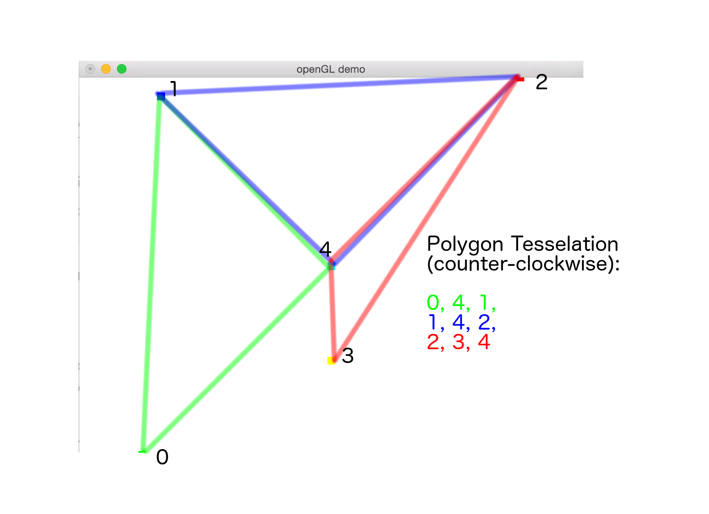

glutdemo
========

Steven Shea

September, 2015

----------

# Lab 1 submission:

## controls:

### scene
* 1: view square with black outline
* 2: view hsv wheel
* 3: view green concave polygon

### camera keyboard controls
* w, a, s, d: translate camera
* i, j, k, l: two degree of freedom rotation
* e: zoom out
* q: zoom in

### polygon tessellation

Here is a diagram that I used to produce the
tessellated index array for the concave polygon.

## credits

This project uses the following library dependencies

* [freeglut](http://freeglut.sourceforge.net/)
* [devIL](http://openil.sourceforge.net/)
* [glew](http://glew.sourceforge.net/)

In addition, I make use of utility functions from these sources:

* [Zed Shaw's Learn C the Hard Way](http://c.learncodethehardway.org/book/) (debugging macros)
* [hinmath.h, C vector header](https://github.com/datenwolf/linmath.h)
 (public domain)